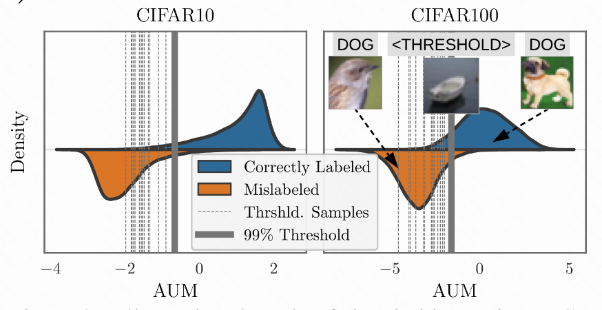

Identifying Mislabeled Data using the Area Under the Margin Ranking

> **作者 (Authors):** 
> **会议/期刊 (Venue):** 
> **年份 (Year):** 2020
> **链接 (Link):** [Paper](https://arxiv.org/abs/2001.10528) | [Code](URL) | [Project](URL)

---

## 📌 基本信息

- **论文类型：** Method 
- **阅读日期：** 2025-10-25
- **阅读状态：**  ✅ 已完成

---

## 🎯 核心问题

*这篇论文要解决什么问题？为什么这个问题重要？*

---

## 💡 核心思想

*用1-3句话概括论文的核心方法或贡献*

---

## 🏗️ 方法架构

### 整体框架

### 关键名词解释

#### 1. Margin (边距)

论文中对“边距”的定义非常关键。对于一个样本 (x, y)（y 是它被分配的标签），它在训练中某一时刻 t 的边距 M^(t)，指的是其被分配标签 y 对应的 logit 分数，与所有其他类别中最高 logit 分数之间的差值 。

正边距：意味着模型当前预测该样本属于 y 类的置信度，高于其他任何一个类。这通常表示一个“正确”的预测。

负边距：意味着有另一个类的置信度比 y 类还高。这通常表示一个“错误”的预测 

#### 2. Area Under the Margin (AUM, 边距下面积)

这是本文最核心的统计量。它不是看某个瞬间的边距，而是将一个样本在整个训练过程中、每一个训练周期 (epoch) 的边距值取平均 。

这么做的好处是，可以消除训练中偶然的波动，获得一个更稳定、更能反映样本“真实学习特性”的指标 。一个持续“纠结”的错误样本，其 AUM 值会很低甚至为负；而一个持续被正确学习的样本，其 AUM 值会比较高 。

#### 3. 训练动态

指在整个模型训练期间（从第一个 epoch到最后一个 epoch），模型内部的各种参数、或者针对某个特定训练样本的各种度量（如损失、边距、logits）是如何随时间演变的 。本文正是利用了 logits 和边距的训练动态来挖掘数据质量的信息

#### 4. Threshold Samples (阈值样本)
这是论文提出的一个巧妙机制，用于自动设定一个“分界线”来区分好坏样本。具体做法是：从训练集中随机拿出一小部分数据，然后给它们分配一个全新的、不存在的假标签（例如，在一个10分类问题中，给它们分配第11类标签）。

由于这些“阈值样本”的标签是凭空捏造的，所以它们百分之百是错误标签样本 。因此，它们在训练中计算出的 AUM 值，就可以作为一个非常可靠的参照基准，来判断原始数据集中哪些样本的 AUM 值“低得不正常” 。

### 算法流程

第一步：定义和计算 AUM 统计量

计算单步边距 (Margin)

假设你正在训练一个神经网络。在第 t 个训练周期 (epoch)，对于一个训练样本 (x, y)（其中 x 是输入图像，y 是它被分配的标签），模型会给出一个 logit 向量 $z^{(t)}(x)$。

该时刻的边距 $M^{(t)}(x, y)$ 按以下公式计算：

\[
M^{(t)}(x, y) = z^{(t)}_{y}(x) - \max_{i \ne y} z^{(t)}_{i}(x)
\]

公式说明:
- $z^{(t)}_{y}(x)$：对应标签 $y$ 的 logit 分量值。
- $\max_{i \ne y} z^{(t)}_{i}(x)$：除 $y$ 外所有类别的最大 logit 分量。
这个公式的本质就是衡量“模型对指定标签的信心”比“对第二可能的标签的信心”高出多少。

计算边距下面积 (AUM)

在整个训练过程（总共 T 个 epochs）中，你需要记录下每个样本在每个 epoch 的边距值。

训练结束后，每个样本的 AUM 值就是它所有边距值的平均值：

\[
\mathrm{AUM}(x, y) = \frac{1}{T} \sum_{t=1}^{T} M^{(t)}(x, y)
\]

公式说明:

- $\mathrm{AUM}(x, y)$ 是在 $T$ 个 epoch 上边距的平均值，起到平滑训练噪声的作用。

第二步：构建阈值样本并学习阈值

我们的目标是找到一个阈值 $\alpha$，当某个样本的 $\mathrm{AUM}(x,y) \le \alpha$ 时，就认为它是错误标签。这个阈值 $\alpha$ 不能凭空设定，因为它和具体的数据集、模型都有关 。

构造阈值样本

假设原始训练集 D_train 有 N 个样本，c 个类别。

首先，为你的分类任务增加一个新的类别，变成 c+1 类。相应地，神经网络的输出层也需要增加一个神经元 。

从 D_train 中随机选择一部分样本作为“阈值样本” D_THR。论文建议选择的数量是 N/(c+1)，这样可以保证这个新类别的样本数量与其他类别大致相当 。

将 D_THR 中所有样本的标签强制修改为这个新的假标签 c+1。

这样，你就得到了一个新的、修改过的训练集 D_train'，它由“被修改标签的阈值样本”和“剩余的原始样本”组成 。

训练并计算阈值

用这个修改后的训练集 D_train' 来训练你的网络 。

在训练过程中，记录所有样本（包括原始样本和阈值样本）在每个 epoch 的 logits，以便后续计算它们的 AUM 值 。论文建议，这个训练过程不需要跑完，通常跑到“第一次学习率下降”时就可以停止，因为此时模型还未完全记住那些错误样本，AUM 的区分度最好 。

训练停止后，计算出所有阈值样本 D_THR 的 AUM 值。

将这些阈值样本的 AUM 值进行排序，取其第99百分位数作为最终的阈值 α 。

第三步：识别并移除错误标签数据

识别

现在你有了一个数据驱动的阈值 $\alpha$。遍历所有未被选为阈值样本的原始数据，计算它们的 $\mathrm{AUM}$ 值。

如果一个样本 (x, y) 的 $\mathrm{AUM}(x, y) \le \alpha$，那么它就被识别为错误标签样本 。

完整流程

注意，上述过程只能识别出“非阈值样本”中的坏数据。为了能检查所有数据，论文建议重复这个过程：例如，将数据分成两半，第一次用第一半做阈值样本来检查第二半，第二次用第二半做阈值样本来检查第一半 。这样总的计算量约等于将一个网络训练两次（每次都只训练到一半）。

识别出所有错误标签样本后，将它们从训练集中移除，得到一个“干净”的数据集。

最后，用这个干净的数据集从头开始训练一个最终的模型 。

---

## 💭 个人思考

AUM的标签转移部分是否可以适配ltl

## 🔖 标签

`LNL` 

---

